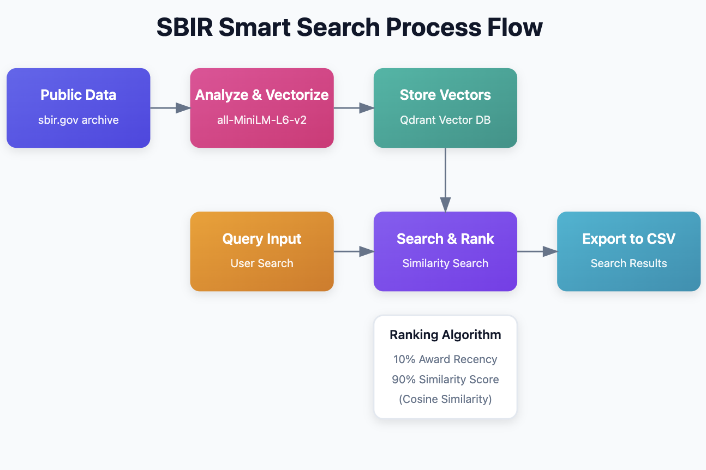

# SBIR Smart Search

An open-source semantic search engine for SBIR/STTR technology awards using AI embeddings.

## 🌟 Key Features
- Flexible semantic search with customizable language models
- Advanced vector indexing for SBIR/STTR awards
- Efficient similarity search using Qdrant
- Command-line and API interfaces
- Easy CSV export of search results

## 🔬 Model Flexibility

### Language Model Selection
The project is designed to be model-agnostic. By default, it uses `sentence-transformers/all-MiniLM-L6-v2`, but you can easily replace it with any sentence transformer model.

Recommended Models:
- `all-MiniLM-L6-v2`: Lightweight, general-purpose (default)
- `allenai/scibert_scivocab_uncased`: Specialized for scientific and technical domains
- `sentence-transformers/all-mpnet-base-v2`: High-performance general semantic search
- `microsoft/MiniLM-L12-H384-uncased`: Enhanced version of default model

To change the model:
1. Update the model initialization in `indexer.py`
2. Update the model initialization in `search.py`

### Customization Tips
- Experiment with different models based on your specific use case
- Consider model performance, computational requirements, and accuracy

## 📊 SBIR Smart Search Process Flow



This diagram illustrates the end-to-end process of the SBIR Smart Search system:

1. **Public Data**: Ingests data from the sbir.gov archive.
2. **Analyze & Vectorize**: Processes and vectorizes the data using the all-MiniLM-L6-v2 model.
3. **Store Vectors**: Saves the resulting vectors in the Qdrant Vector DB.
4. **Query Input**: Accepts user search queries.
5. **Search & Rank**: Performs similarity search and ranks results.
6. **Export to CSV**: Exports search results to a CSV file.

The ranking algorithm considers:
- 10% Award Recency
- 90% Similarity Score (using Cosine Similarity)

## 🚀 Prerequisites
- Python 3.9+
- Qdrant vector database
- 8GB+ RAM recommended
- Optional: GPU for faster processing
  
## 🛠️ Installation

1. Clone the repository:
```bash
git clone https://github.com/yourusername/sbir-smart-search.git
cd sbir-smart-search
```

2. Install dependencies:
```bash
python -m venv venv
source venv/bin/activate  # On Windows: venv\Scripts\activate
pip install -r requirements.txt
```

3. Install Qdrant:
```bash
docker pull qdrant/qdrant
docker run -p 6333:6333 qdrant/qdrant
```

## 📊 Quick Start

1. Prepare your SBIR/STTR awards CSV
2. Run indexing:
```bash
python indexer.py
```

3. Start searching:
```bash
python search.py
```

## 🔍 Search Capabilities
- Semantic search for technologies and topics
- Flexible company name matching
- Customizable result ranking
- CSV export functionality

## 🤝 Contribute
- Report issues
- Suggest model improvements
- Enhance search algorithms
- Improve documentation

## 📜 License
MIT License

## 🏢 Powered By
- Sentence Transformers
- Qdrant Vector Database
- Python
