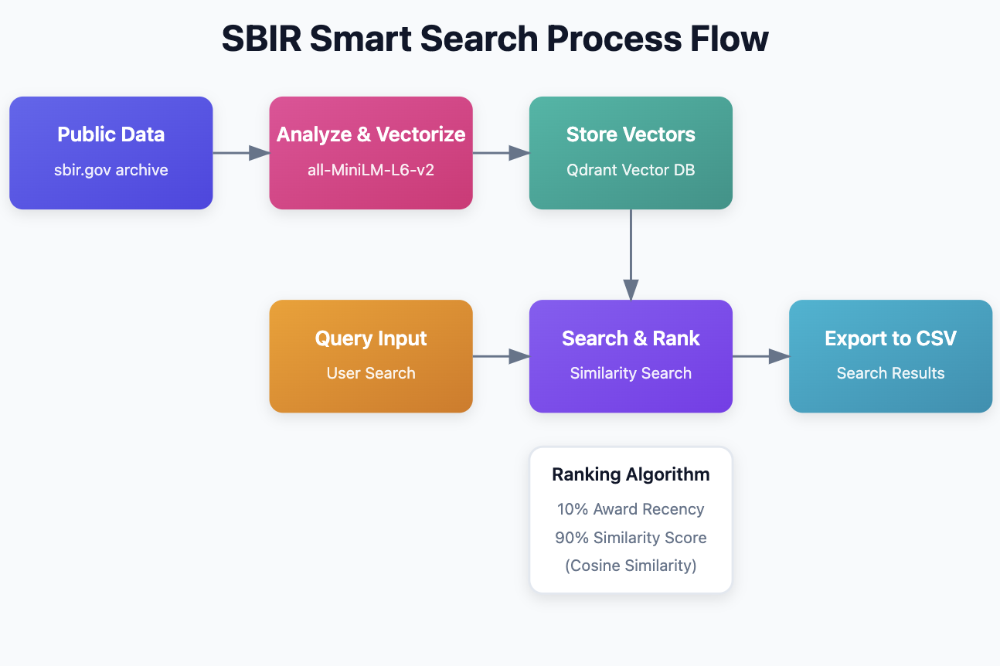

# SBIR Smart Search

Semantic search across the public SBIR/STTR award database — 201,000+ awards from
1983 to today, searchable by what the research actually *is* rather than by keyword.

Ask for "lightweight batteries for small drones" and you get awards about energy-dense
power systems for UAVs, even when they never use those words. Everything runs locally:
one command downloads the data and builds the index, a second starts the web UI.



## Quick start

Requires Python 3.10 or newer.

```bash
git clone https://github.com/howiewanie/sbir_smart_search.git
cd sbir_smart_search

python -m venv .venv && source .venv/bin/activate    # Windows: .venv\Scripts\activate
pip install -r requirements.txt

python -m sbir setup      # downloads ~350 MB from SBIR.gov, then builds the index
python -m sbir serve      # http://127.0.0.1:8000
```

`setup` is a one-time step. On a four-core laptop it embeds the full corpus in a little
over 20 minutes at roughly 150 awards/second; a GPU cuts that to a couple of minutes.
In a hurry:

```bash
python -m sbir setup --since 2020    # ~27k recent awards, about 3 minutes
```

There is no database server to install and no Node toolchain. Qdrant runs in embedded
mode out of the box, and the front end is plain HTML, CSS and JavaScript.

## What you get

- **Meaning-based search.** Queries are embedded with a sentence-transformer and compared
  against every award abstract by cosine similarity.
- **Filters that matter.** Agency, branch, phase, program, state, award year, dollar
  amount, and set-aside status (woman-owned, HUBZone, disadvantaged).
- **Company lookup.** Switch the mode selector to *Company* to pull every award a firm
  has ever won.
- **Shareable results.** The URL always reflects the current query and filters.
- **CSV export** of whatever is on screen, filters included.
- **A terminal client**, if you would rather not leave the shell.

## Command line

```bash
python -m sbir setup [--since YEAR] [--limit N] [--force]
python -m sbir fetch [--force]            # just download the CSV
python -m sbir index [--since YEAR]       # just rebuild the vectors
python -m sbir serve [--host] [--port] [--reload]
python -m sbir status                     # what is downloaded and indexed
python -m sbir search QUERY [options]
```

Searching without the browser:

```bash
python -m sbir search "solid state battery" --agency "Department of Energy" -n 5
python -m sbir search "hypersonics" --phase "Phase II" --year-min 2018 --abstracts
python -m sbir search "luna innovations" --mode company --sort amount
```

Worth knowing: SBIR and STTR are small-business programs, so the large primes are not in
here. Searching for Lockheed or Raytheon correctly returns nothing. The most prolific
awardees are firms like Physical Optics, Physical Sciences, Creare and Luna Innovations.

## How ranking works

A query returns a pool of nearest neighbours, which is then re-scored:

```
score = 0.90 x cosine_similarity
      + 0.10 x recency
      + 0.05 x share of query words appearing in the title
```

Recency decays linearly and bottoms out at 20 years, so a 2024 award edges out a 2005 one
when the two are equally relevant, but a genuinely better match still wins. The keyword
term is deliberately small: it rewards an obvious literal hit without letting keyword
stuffing beat meaning. Tune the balance with `SBIR_RECENCY_WEIGHT`.

## Configuration

Every setting is an environment variable. The defaults are what most people want.

| Variable | Default | Purpose |
| --- | --- | --- |
| `SBIR_DATA_DIR` | `./data` | Where the CSV and vector index live |
| `SBIR_MODEL_NAME` | `sentence-transformers/all-MiniLM-L6-v2` | Any sentence-transformers model |
| `SBIR_MAX_SEQ_LENGTH` | `128` | Tokens embedded per award |
| `SBIR_BATCH_SIZE` | `64` | Embedding batch size |
| `SBIR_RECENCY_WEIGHT` | `0.10` | How much newer awards are favoured |
| `SBIR_QDRANT_URL` | unset | Point at a Qdrant server instead of embedded mode |
| `SBIR_PORT` | `8000` | Web UI port |

Swapping the model is a one-liner, though you have to rebuild the index afterwards since
the vectors change shape:

```bash
SBIR_MODEL_NAME=BAAI/bge-small-en-v1.5 python -m sbir index
```

`all-MiniLM-L6-v2` is the default because it is small, quick on CPU, and good enough for
technical abstracts. `bge-base-en-v1.5` and `all-mpnet-base-v2` score better on retrieval
benchmarks at roughly three times the indexing cost.

### Performance

Measured on a four-core cloud VM with no GPU, against the full 201k-award index:

| Operation | Time |
| --- | --- |
| Building the index | ~23 min (about 150 awards/sec) |
| Embedding one query | ~7 ms |
| Semantic search | ~450-600 ms |
| Semantic search with filters | ~460 ms |
| Company lookup | ~50 ms |

Embedded Qdrant compares the query against every vector, so semantic search cost scales
with corpus size. That is fine for a single user on a laptop.

Two things stop filters and company lookups from being much slower than that. Embedded
Qdrant evaluates a filter point by point in Python, which measured about five times the
cost of a plain scan, so a filtered search instead pulls a wider unfiltered pool and
narrows it locally. That returns the same rows — anything outside the pool already scored
below everything in it — and only falls back to a true filtered query when the filter is
narrow enough to exhaust the pool. Company lookups skip the vector store almost entirely:
names resolve through a dictionary built at index time, and the awards come back by id.

If half a second is too slow for your use, run a Qdrant server. It builds an HNSW index
and answers approximate queries without touching every vector.

### Running against a Qdrant server

Embedded mode keeps the index in a local directory, which is ideal for one person on one
machine. For a shared deployment, point the app at a real server and payload indexes get
created automatically:

```bash
docker run -p 6333:6333 -v "$(pwd)/qdrant_storage:/qdrant/storage" qdrant/qdrant
SBIR_QDRANT_URL=http://localhost:6333 python -m sbir index
SBIR_QDRANT_URL=http://localhost:6333 python -m sbir serve
```

## HTTP API

The UI is a client of a small JSON API, so anything it does you can script.

| Endpoint | Notes |
| --- | --- |
| `GET /api/search` | `q`, `mode`, `sort`, `limit`, `offset`, plus any filter |
| `GET /api/export.csv` | Same parameters, returns a CSV attachment |
| `GET /api/facets` | Filter values present in the index |
| `GET /api/stats` | Index size, model, coverage |
| `GET /api/companies?q=` | Company name suggestions |
| `GET /api/docs` | Generated OpenAPI docs |

```bash
curl "localhost:8000/api/search?q=quantum%20sensing&phase=Phase%20II&limit=3"
curl "localhost:8000/api/export.csv?q=biosensor&year_min=2019" -o biosensor.csv
```

## Notes on the data

`award_data.csv` is the official bulk export from SBIR.gov. It is refreshed upstream
periodically; `python -m sbir setup --force` pulls a new copy and reindexes.

The export carries about 207,000 rows; roughly 201,000 survive cleaning. The rest are
dropped for having no title, no abstract, or no usable award year. About 14% of the
awards that remain have a title but no abstract — they are still indexed and can surface,
they just match less precisely.

The full embedded index occupies about 1.2 GB on disk. Indexing peaks around 3.5 GB of
RAM, so 8 GB is a comfortable minimum.

One caveat with embedded mode: the index directory is opened exclusively, so only one
process can use it at a time. Running `python -m sbir search` while `serve` is up will
fail with a lock error. Stop the server first, or run a Qdrant server as described above
and let both share it.

## Project layout

```
sbir/
  cli.py        command line entry point
  dataset.py    download and clean the SBIR.gov export
  embedder.py   sentence-transformers wrapper
  indexer.py    CSV -> vectors
  search.py     query planning, filters, ranking
  store.py      Qdrant access (embedded or server)
  api.py        FastAPI routes
web/            the front end: one HTML file, one stylesheet, one script
```

## License

MIT. The award data itself is a public record published by SBIR.gov.
