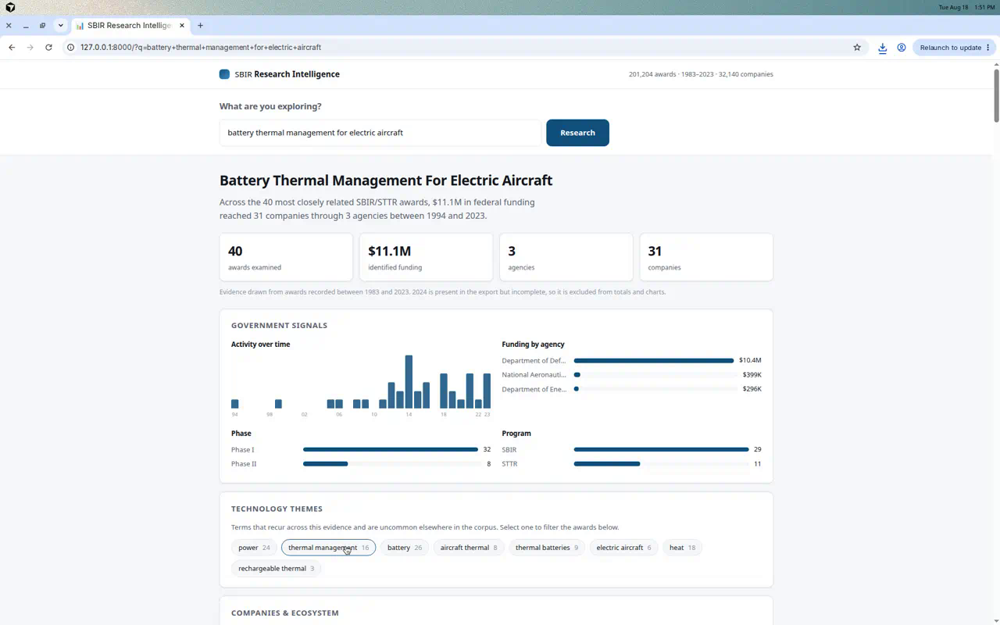
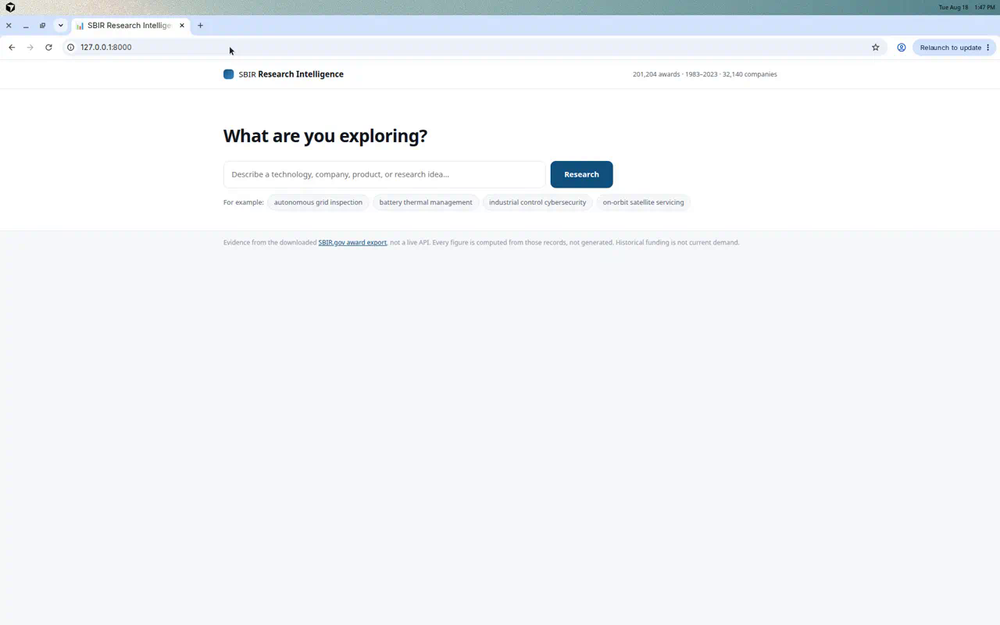

# SBIR Research Intelligence

Ask a question. Get a report on what the U.S. government has actually funded in
that area — who won the work, which agencies paid, how the field matured, and
the awards themselves. Then download the whole thing as PDF or Word.

No API key. No account. Clone, install, run.



[Watch the 2026 walkthrough](https://youtu.be/uucM-LzfYf0) 

## Quick start

Requires Python 3.10 or newer.

```bash
git clone https://github.com/howiewanie/sbir_smart_search.git
cd sbir_smart_search

python -m venv .venv && source .venv/bin/activate    # Windows: .venv\Scripts\activate
pip install -r requirements.txt

python -m sbir setup      # downloads the award CSV, then builds the index
python -m sbir serve      # http://127.0.0.1:8000
```

`setup` is a one-time step. On a four-core laptop it embeds the full corpus in a
little over 20 minutes; a GPU cuts that to a couple of minutes. In a hurry:

```bash
python -m sbir setup --since 2020    # ~27k recent awards, about 3 minutes
```

There is no database server to install and no Node toolchain. Qdrant runs in
embedded mode. The front end is plain HTML, CSS and JavaScript.

## The data (read this)

Reports are built from a **downloaded bulk file**, not from a live SBIR.gov API.

The official award API has not been reliable. Until it is, `python -m sbir setup`
pulls the public CSV export:

[https://data.www.sbir.gov/awarddatapublic/award_data.csv](https://data.www.sbir.gov/awarddatapublic/award_data.csv)

If that API starts working, fetch can be pointed at it. Right now the downloaded
file is the source of truth.

What that means in practice:

- **The export lags real awards.** The copy indexed here is complete through
  **2023**. 2024 is present but only a handful of rows, so the app treats it as
  incomplete and keeps it out of totals and charts. That drop-off is a data
  hole, not a collapse in funding.
- **Historical funding is not current demand.** An agency that awarded work in
  2019 is a lead to investigate, not evidence of an open solicitation.
- Roughly 201,000 awards survive cleaning (title or abstract, plus a usable
  year). About 14% have a title but no abstract; they can still surface, they
  just match less precisely.
- Re-download a newer export with `python -m sbir setup --force`.

SBIR and STTR are small-business programs, so the large primes are not in here.
Searching for Lockheed or Raytheon correctly returns nothing.

## What you get

- A research report: funding, agencies, phases, themes, companies, and the
  underlying awards.
- **Download PDF** or **Download Word** of that same report. Every number in
  the file is counted from the awards on screen, not written by a model.
- A printable two-page brief of the page, if you would rather print than save.
- Shareable URLs. The query lives in the address bar.
- A terminal client, if you would rather not leave the shell.



## Command line

```bash
python -m sbir setup [--since YEAR] [--limit N] [--force]
python -m sbir fetch [--force]            # just download the CSV
python -m sbir index [--since YEAR]       # just rebuild the vectors
python -m sbir serve [--host] [--port] [--reload]
python -m sbir status                     # what is downloaded and indexed
python -m sbir search QUERY [options]
```

```bash
python -m sbir search "solid state battery" --agency "Department of Energy" -n 5
python -m sbir search "hypersonics" --phase "Phase II" --year-min 2018 --abstracts
```

## How it works

The award CSV is normalised, each title and abstract is embedded, and those
vectors go into Qdrant. A query is embedded the same way. The closest awards
are trimmed to a readable evidence set (duplicate filings collapsed, any one
company capped), then the report is arithmetic over that set: funding, agencies,
phases, themes, companies, and a short reading of those figures.

No language model is involved. The product works with the downloaded file
alone.

## Configuration

Every setting is an environment variable. The defaults are what most people want.

| Variable | Default | Purpose |
| --- | --- | --- |
| `SBIR_DATA_DIR` | `./data` | Where the CSV and vector index live |
| `SBIR_AWARD_DATA_URL` | the official SBIR.gov CSV | Override only if you host a copy |
| `SBIR_MODEL_NAME` | `sentence-transformers/all-MiniLM-L6-v2` | Any sentence-transformers model |
| `SBIR_MAX_SEQ_LENGTH` | `128` | Tokens embedded per award |
| `SBIR_BATCH_SIZE` | `64` | Embedding batch size |
| `SBIR_RECENCY_WEIGHT` | `0.10` | How much newer awards are favoured |
| `SBIR_QDRANT_URL` | unset | Point at a Qdrant server instead of embedded mode |
| `SBIR_PORT` | `8000` | Web UI port |

### Running against a Qdrant server

Embedded mode keeps the index in a local directory, which is ideal for one
person on one machine. Only one process can open it at a time. For a shared
deployment:

```bash
docker run -p 6333:6333 -v "$(pwd)/qdrant_storage:/qdrant/storage" qdrant/qdrant
SBIR_QDRANT_URL=http://localhost:6333 python -m sbir index
SBIR_QDRANT_URL=http://localhost:6333 python -m sbir serve
```

## HTTP API

| Endpoint | Notes |
| --- | --- |
| `GET /api/research?q=` | The intelligence report as JSON |
| `GET /api/research.pdf?q=` | The same report as a PDF attachment |
| `GET /api/research.docx?q=` | The same report as a Word attachment |
| `GET /api/search` | Ranked award list (legacy search) |
| `GET /api/stats` | Index size, model, coverage |
| `GET /api/docs` | Generated OpenAPI docs |

```bash
curl "localhost:8000/api/research?q=quantum%20sensing"
curl "localhost:8000/api/research.pdf?q=biosensor" -o biosensor.pdf
curl "localhost:8000/api/research.docx?q=biosensor" -o biosensor.docx
```

The full index occupies about 1.2 GB on disk. Indexing peaks around 3.5 GB of
RAM, so 8 GB is a comfortable minimum.

## License

MIT. The award data itself is a public record published by SBIR.gov.
